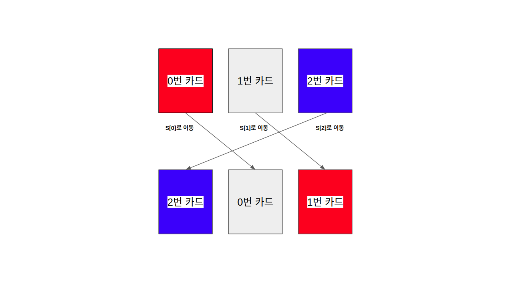

### 문제해설

 [문제](https://www.acmicpc.net/problem/1091)의 정의에 의하면 섞는 순서가 ```1 2 0```일 때, 섞은 후의 순서는 다음과 같습니다. 
 문제의 정답은 항상 맨 처음 카드의 순서(0, 1, ..., N - 1)를 주어진 P에 따라 섞은 값과 같아지게 되는 경우입니다. 

### 아이디어
 
 


### 알고리즘


### 수학적인 증명

[목록](../)
